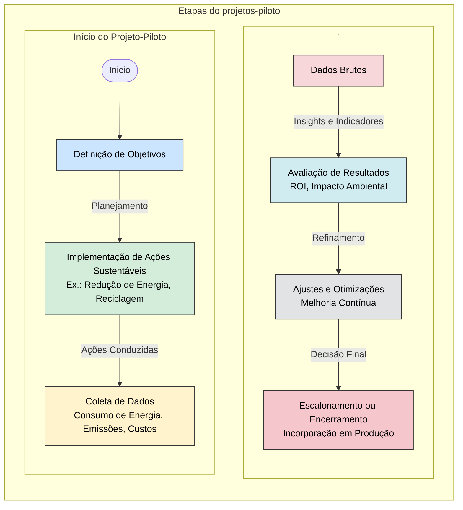

```mermaid
flowchart TB
subgraph Etapas do projetos-piloto
direction TB
    subgraph .
    direction TB
        D[Dados Brutos] -->|Insights e Indicadores| E[Avaliação de Resultados<br/>ROI, Impacto Ambiental]
        E-->|Refinamento| F[Ajustes e Otimizações<br/>Melhoria Contínua]
        F -->|Decisão Final| G[Escalonamento ou Encerramento<br/>Incorporação em Produção]
    end
    subgraph Início do Projeto-Piloto
    direction TB
        x([Inicio]) --> A[Definição de Objetivos] -->|Planejamento| B[Implementação de Ações Sustentáveis<br/>Ex.: Redução de Energia, Reciclagem]
        B -->|Ações Conduzidas| C[Coleta de Dados<br/>Consumo de Energia, Emissões, Custos]
    end
end

    style A fill:#cce5ff,stroke:#333,stroke-width:1px, color:#000
    style B fill:#d4edda,stroke:#333,stroke-width:1px, color:#000
    style C fill:#fff3cd,stroke:#333,stroke-width:1px, color:#000
    style D fill:#f8d7da,stroke:#333,stroke-width:1px, color:#000
    style E fill:#d1ecf1,stroke:#333,stroke-width:1px, color:#000
    style F fill:#e2e3e5,stroke:#333,stroke-width:1px, color:#000
    style G fill:#f5c6cb,stroke:#333,stroke-width:1px, color:#000

```

C -->|Dados Brutos| D[Análise dos Dados Estatística, Comparativos]
    C -->|Dados Brutos| D[Análise dos Dados Estatística, Comparativos]
D -->|Insights e Indicadores| 