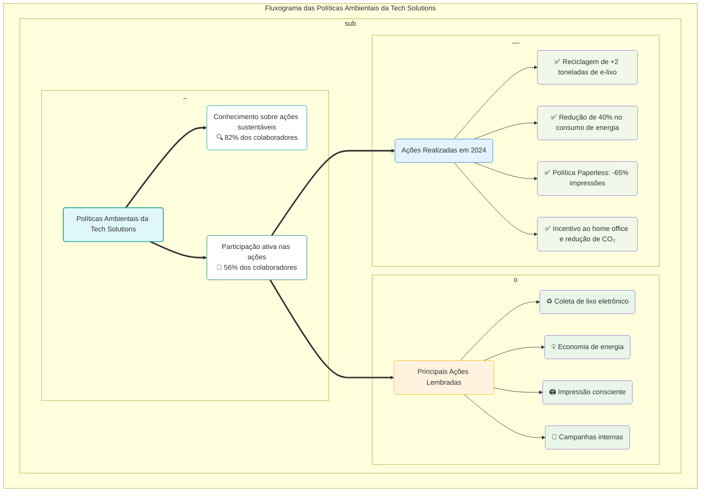

```mermaid
flowchart TD
    A(Políticas Ambientais da Tech Solutions)
    subgraph "Fluxograma das Políticas Ambientais da Tech Solutions"
        subgraph sub
            direction LR
            subgraph _
            A ==> B1(Conhecimento sobre ações sustentáveis<br/>🔍 82% dos colaboradores)
            A ==> B2(Participação ativa nas ações<br/>🤝 56% dos colaboradores)
        end
        B2 ==> C1(Principais Ações Lembradas)
        subgraph o
            direction LR
            C1 --> D1(♻️ Coleta de lixo eletrônico)
            C1 --> D2(💡 Economia de energia)
            C1 --> D3(🖨️ Impressão consciente)
            C1 --> D4(📢 Campanhas internas)
        end

        B2 ==> E1(Ações Realizadas em 2024)
        subgraph __
            direction LR
            E1 --> F1(✅ Reciclagem de +2 toneladas de e-lixo)
            E1 --> F2(✅ Redução de 40% no consumo de energia)
            E1 --> F3(✅ Política Paperless: -65% impressões)
            E1 --> F4(✅ Incentivo ao home office e redução de CO₂)
        end
    end

    style A fill:#e0f7fa,stroke:#26a69a,stroke-width:2px
    style B1 fill:#ffffff,stroke:#0097a7,stroke-width:1px
    style B2 fill:#ffffff,stroke:#00796b,stroke-width:1px
    style C1 fill:#fff3e0,stroke:#ffb300,stroke-width:1px
    style D1 fill:#e8f5e9
    style D2 fill:#e8f5e9
    style D3 fill:#e8f5e9
    style D4 fill:#e8f5e9
    style E1 fill:#e3f2fd,stroke:#1976d2,stroke-width:1px
    style F1 fill:#f1f8e9
    style F2 fill:#f1f8e9
    style F3 fill:#f1f8e9
    style F4 fill:#f1f8e9

    end

```